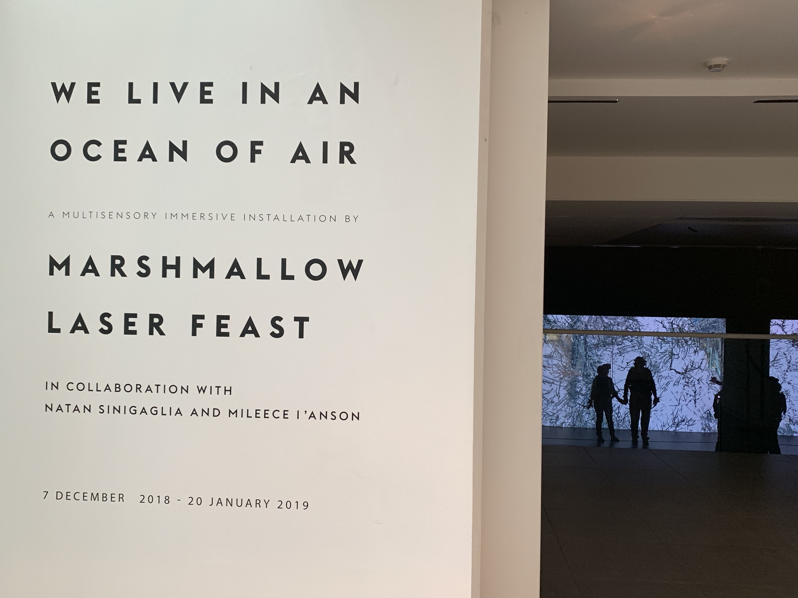
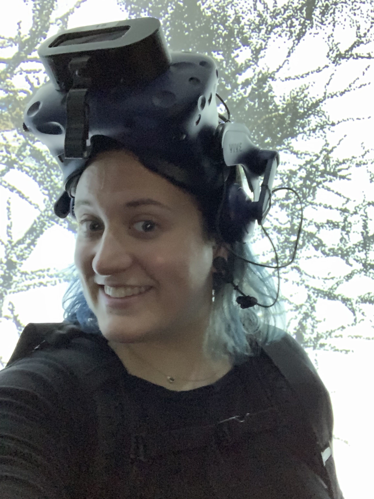
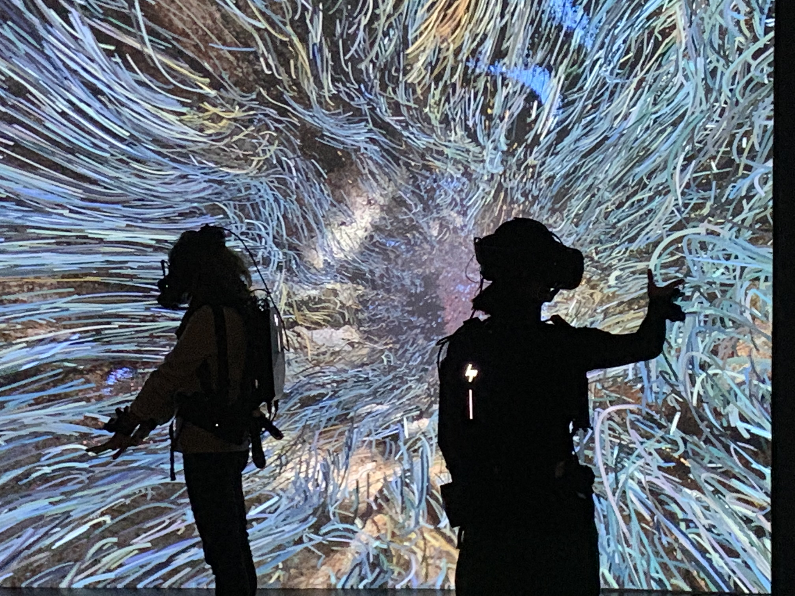

# We Live in an Ocean of Air

{:height="400px"}

I visited London last week to give an informal introduction to the work I’m doing with Mixed Reality privacy at the Mozilla London office. Luckily, this magically coincided with the office’s holiday party (imagine that…)

Tickets are timed entry—while you wait, you can watch others moving around in the experience and watch (a much more limited version of) the virtual environment on a screen. When it was my turn, I entered a small vestibule with 5 others (including my husband), where our “host” explained that we would put on a backpack that held a computer hooked up to a VR headset. Instead of holding controllers, they wrapped controllers around the wrists. Then, I put the headset (HTC Vive) on, they clipped a heartbeat monitor on my earlobe, and put headphones on.

{:height="250px"}

They warned us that if anything went wrong or we felt ill, we should just lift the headset and they’ll be over to assist.

There were a few basic elements to the installation: a video/3D environment, immersive elements generated during the session, and sound. The world was focused around an ancient sequoia tree—I won’t spoil it—then morphed into a much more abstract environment. Overall, the experience was meditative, focusing on your breath and allowing you to visualize how your breath is released into the environment around you. A CO2 sensor recorded and transmitted information about exhalations, which was then incorporated into the shared immersive world. 

{:height="400px"}

I found it particularly interesting how they augmented the virtual world by incorporating data extracted from the physical world. Infrared sensors detected others in the space and created red blobs to prevent you from walking into others. This was…not always successful (I also have issues with depth perception, so that didn’t help). It created both an isolating feeling and a weird sense of togetherness. Isolating, because you can’t really interact with the others in the space (and when I called out to see if it’s my husband I just walked into, I couldn’t hear a response), but together, since you’re not just interacting with your breath, but everyone’s. It was particularly interesting when I reached for Ricky’s hand. In the virtual world, our hands met much sooner than they did in the physical world. I noticed some people walking around hand-in-hand with their companions, looking desperate to maintain that contact. It would be particularly interesting to see a similar experience on a platform like Hubs.

After some time, the virtual world became much more abstract. The floor dropped away and you were left in a space completely without boundaries (until you approached the boundaries of the actual room when the room grid showed up to tell you not to walk into a wall). This was particularly uncomfortable/disorienting for me, and I found myself focusing strongly on the sensation of my feet on the ground. As a work of art, I can appreciate the feelings of discomfort, but I think we should keep in mind that VR affects the physical body much more strongly than most other digital mediums. I didn’t feel the need to take my headset off, but I did need to pause for a bit.

Overall, I enjoyed the installation and would recommend it. You can book tickets [here](https://www.saatchigallery.com/art/salon_009.php) (£20). You do need to book ahead, because they only have a limited number of headsets.

I had discussions about the technical details and data collection both before and after the experience with the hosts/technicians (because that’s apparently what I do now). I am excited to see mixed reality as an art medium. At the same time, any immersive art also needs to consider the privacy aspect of the medium. Even if that’s not the primary intent of the work, data collection and privacy are fundamental to any MR experiences and deserve to be approached thoughtfully and respectfully.

For anyone who is unfamiliar with the privacy concerns associated with mixed reality, here are some potential risks:

- tracking gaze in a virtual world can reveal whether a person has [ADHD](https://www.psychologicalscience.org/news/releases/eye-movements-reveal-temporal-expectation-deficits-in-adhd.html) or [autistic characteristics](https://www.sciencedaily.com/releases/2016/03/160331082651.htm) and [indicate sexual orientation/attraction](https://www.ncbi.nlm.nih.gov/pmc/articles/PMC4273641/)
- devices analyze the way we move in a virtual space to enable physical/virtual interactions. Interactions like head/body movements (including gait) can be used to [identify individuals](https://www.newscientist.com/article/mg21528835-600-cameras-know-you-by-your-walk/)
- any biometrics (like heart rate/breath) can reveal information about underlying health conditions
- we know that VR can be [used therapeutically](https://www.mobihealthnews.com/content/depth-therapeutic-vr-2018-no-longer-just-distraction-therapy); however, this implies that it could also induce very negative physical/mental/emotional consequences (this hasn’t been studied because we’re not going to try to induce PTSD via VR for obvious reasons)

After I took the headset off, I though about how fascinating it would be to look at heart rate data, the prerecorded video, and the breath simultaneously. Did my heart race when the ground disappeared? What’s the difference in my physiological response compared to someone experiencing this for the first time? 

Mixed reality provides a new way to experience the universe. Art has a unique ability to inform and educate, and I encourage everyone interested in working in the space to consider how we can convey both the joy of immersive experiences and the complex questions of biometric data collection and use.

## My recommendations for immersive installations:
- be clear about the data that can be collected by any devices used
- if you are collecting data, state this upfront, as well as your plans for using the data (also address if the data is processed locally or sent elsewhere)
- keep in mind that just because you don’t necessarily link identities to data doesn’t mean the data is anonymous

The worst case scenario for me is that we become accustomed to simply putting immersive tech on and not thinking about the privacy implications. On the flip side, I am (I swear) an optimist about immersive technology, so I don’t want our fears and concerns to stop us from engaging in VR/AR. There’s a balance that we can find, but only if we openly and proactively have ongoing discussions.

