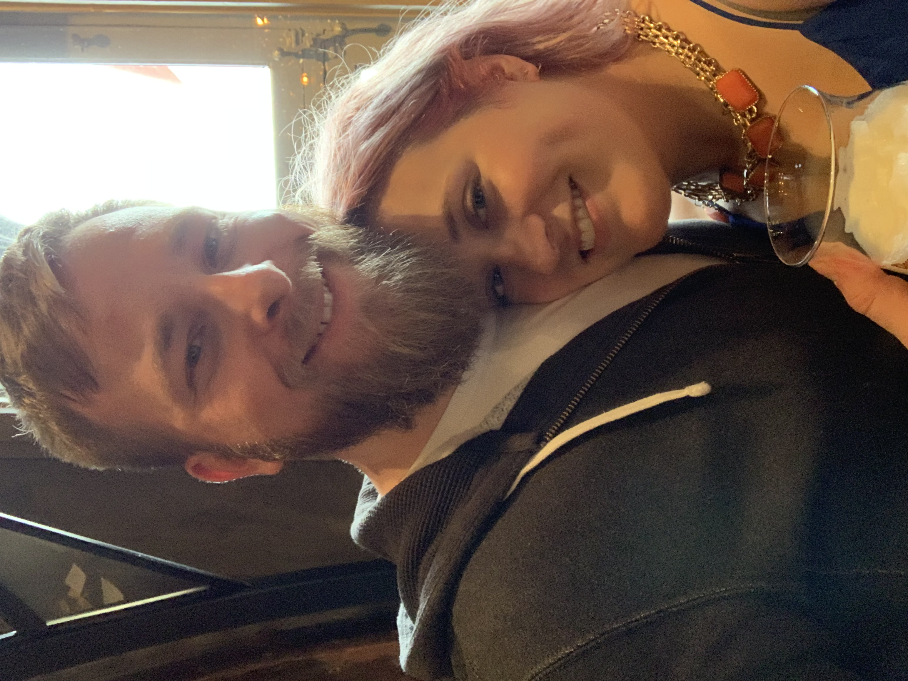
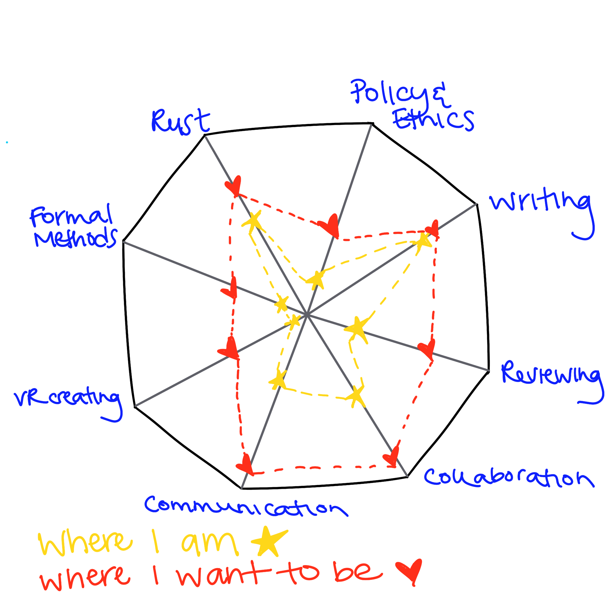

# Oh hey 2019
I realize I'm late to the party. I still haven't sent out my 2018 holiday cards (more on that later). My goals for the first half of 2019 were due today, which always triggers an existential crisis for me.

2018 ended up being pretty transitional for me--I joined the Mixed Reality team at Mozilla to work on privacy and security (while still working on Servo). It takes time to jump into a new role, particularly since I'd only put a VR headset on once before (at an Oculus demo at GHC2014). At the end of the year, my husband and I found out that we'd be moving from the UK, where we've been living for nearly four years, back to the US...and we had two months to execute the move.

We leave on Sunday. So far, in 2019, I've spent a week in California attending RWC, two weeks in New Zealand ([speaking](https://www.youtube.com/watch?v=r6vbSCw5WFE) at LCA), two desperate weeks of cleaning/packing, a long weekend in Bruges and Brussels, and finally a week to say goodbye to the town I've come to love. It hasn't left much time for retrospection, so I'm going to focus on what's next.

{:height="250px"}

# Career
This is purely about my personal goals--not my goals for Firefox Reality/Rust/Servo as projects:
* Privacy experiments with FxR
* Write an RFC for Rust
* Leadership/management training
* Write an academic paper
* Write a series on ethics in emerging tech
* Write a chapter (for a friend's project) on secure programming in Rust

## Skills
Inspired by my friend, [edunham](http://edunham.net/2018/08/24/job_move.html), I considered the skills that I care about right now.

{:height="350px"}

Some programmers might notice that there's a strong emphasis on 'soft skills' here. I'm most effective when I work with others. Over the past year, I've realized that I've become pretty isolated, and it hasn't been good for my mental health. It's also really important for me to communicate better about the work that's being done in the [formal verification](https://github.com/rust-lang-nursery/wg-verification) and [unsafe code guidelines](https://github.com/rust-rfcs/unsafe-code-guidelines) working groups.

# Personal
It's been a stressful time. I'd like to get back to taking care of myself, exercising, and sleeping.

## Financial
Moving is expensive...
* replenish savings after the move
* have at least 1x my salary saved for retirement

(besides...you know, having to find a house and cars...)

## Miscellaneous
* Do a 30 day yoga challenge
* Be able to do a pull up
* Visit friends I haven't seen since moving away <3
* Throw a housewarming party!
* Embrace inbox0
* Send out my 2018 holiday cards before June 😂
* Get involved with a charity/foundation